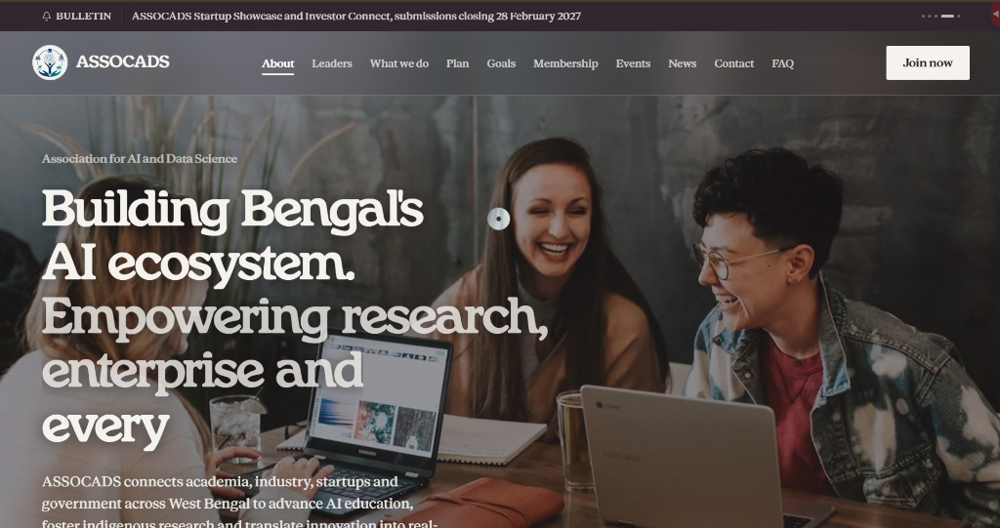
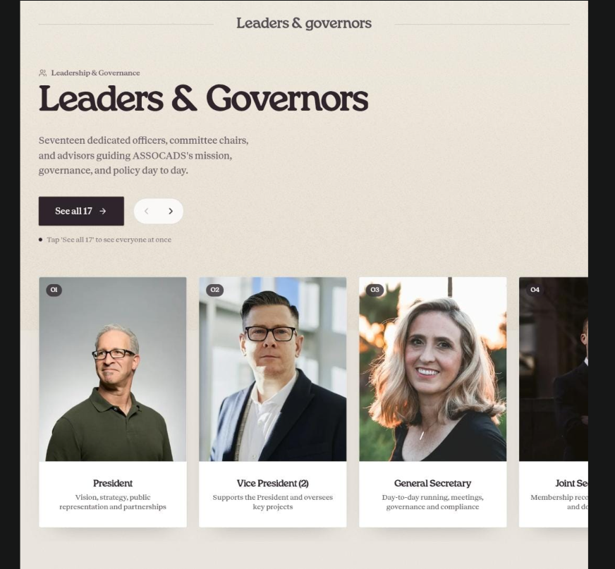
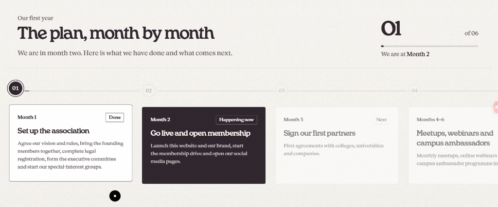
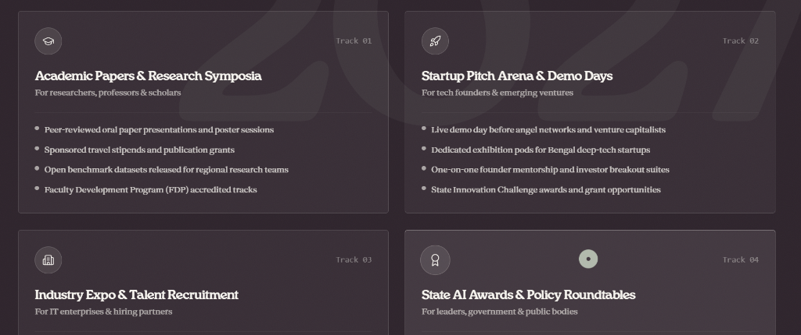

# ASSOCADS — Association for AI and Data Science

> **Registered Public Charitable Trust** · Salt Lake Sector V, Kolkata, West Bengal  
> *Collaborate · Connect · Create Impact*

---

## 🌟 Executive Overview

**ASSOCADS** (*Association for AI and Data Science*) is a registered non-profit public charitable trust established to build, empower, and unify West Bengal's artificial intelligence and data science ecosystem.

By connecting **academia**, **industry**, **emerging startups**, and **government bodies**, ASSOCADS ensures that cutting-edge AI education, indigenous technological research, and ethical technology governance are accessible to every student, educator, and practitioner across the state.

---

## 📸 Web Portal Preview

### The Hero Experience
The primary digital gateway introduces the state-wide mission, immediate action avenues, live community bulletins, and real-time membership onboarding.

*Live portal featuring the editorial design system, typography hierarchy (Henrietta Display & Anthropic Serif), live ecosystem bulletin ticker, and transparent community onboarding.*

---

## 🏛️ About ASSOCADS

### 1. Who We Are
ASSOCADS is West Bengal's dedicated non-profit public platform for advancing artificial intelligence, machine learning, and data science. We operate not as a commercial tech venture or an expensive gated club, but as a public charitable institution governed by a registered Trust Deed. Every rupee mobilized is channeled back into subsidized student training, public research datasets, open-access seminars, and merit scholarships.

### 2. The Core Mission
- **Democratizing AI Literacy**: Bringing high-quality, practical data science training to every college, university, and community in Bengal, including regional-language learning resources.
- **Translating Research to Reality**: Supporting researchers and faculty with grants, compute credits, and cross-university consortiums to solve regional challenges in healthcare, agriculture, and civic infrastructure.
- **Bridging the Academia–Industry Chasm**: Aligning university curricula with employer demands through direct internships, corporate recruitment pavilions, and faculty development programs.
- **Nurturing Indigenous Startups**: Providing early-stage founders in Kolkata and districts with angel investor access, compute vouchers, legal counsel, and state innovation showcase platforms.
- **Championing Ethical & Responsible AI**: Formulating transparent AI governance frameworks and annual State AI Outlook reports to advise public policymakers and institutions.

### 3. Public Trust Governance & Ethics
| Pillar | Commitment |
| :--- | :--- |
| **Legal Status** | Registered Public Charitable Trust under the Indian Trusts Act, headquartered in Salt Lake Sector V, Kolkata. |
| **Tax Exemption** | Contributions and institutional memberships qualify for **Section 80G** tax exemption benefits under the Income Tax Act. |
| **Audited Transparency** | Comprehensive financial audits are conducted annually by statutory Chartered Accountants and published openly for public scrutiny. |
| **Equal Baseline Access** | Under the Universal Charter, a student paying ₹500 receives the identical core community entitlements and special interest access as a large enterprise partner. |
| **100% Need-Based Aid** | Dedicated scholarship reserves provide complete fee waivers for underprivileged students and aspiring researchers. |

---

## 👥 Leadership & Governance

ASSOCADS is steered by seventeen dedicated honorary officers, committee chairs, and advisors guiding strategy, academic relations, startup incubation, and ethics compliance.

### Key Office Bearers
- **President**: Vision, strategy, public representation, and global institutional partnerships.
- **Vice Presidents (2)**: Strategic initiatives, state-level consortiums, and flagship project supervision.
- **General Secretary**: Operational management, official secretarial administration, and statutory compliance.
- **Joint Secretaries (2)**: Membership records, member relations, and institutional communication.
- **Treasurer**: Annual budgeting, statutory accounting, 80G filings, and fiscal audits.
- **Council Chairs**: Specialized chairpersons overseeing *Academic Relations*, *Industry Relations*, *Research & Innovation*, *Events & Summits*, *Training & Certifications*, *Startups & Entrepreneurship*, *Government Relations*, *Marketing & Branding*, *Digital Platforms*, and *Membership Growth*.
- **Statutory Counsel**: Honorary Legal Advisor and Chartered Accountant overseeing compliance and trust governance.

---

## 🗓️ 12-Month Phased Roadmap

ASSOCADS operates on an accountable month-by-month trajectory designed to deliver concrete community milestones from inception through the annual State Summit.

1. **Phase 1: Foundation & Incorporation (Months 1–2)**  
   Adoption of Trust Deed bylaws, executive committee formation, digital portal deployment, and public membership rollout.
2. **Phase 2: Academic & Institutional Accreditations (Months 3–4)**  
   Signing MOUs with leading universities (Jadavpur University, IIT Kharagpur, ISI Kolkata, University of Calcutta) and corporate technology partners.
3. **Phase 3: Community Workshops & Regional Hackathons (Months 5–6)**  
   Statewide student coding competitions, teacher training bootcamps, and monthly expert meetups in Salt Lake Sector V.
4. **Phase 4: Research Symposia & Startup Demo Day (Months 7–9)**  
   Healthcare & Agritech AI research symposium, regional language model benchmarks, and investor pitch sessions for founders.
5. **Phase 5: State Data Science Summit 2027 (Month 12)**  
   Flagship two-day convention at Kolkata, unveiling the annual State AI Impact Report, student project awards, and career expo.

---

## 🎯 Flagship Summit Pillars

The upcoming **State Data Science Summit** serves as Bengal's premier gathering across four distinct conference tracks:

- **Track 01: Academic Papers & Research Symposia**  
  Peer-reviewed paper presentations, poster sessions, travel stipends, and open benchmark regional datasets.
- **Track 02: Startup Pitch Arena & Demo Days**  
  Live demo days before venture funds and angel networks, equity-free compute grants, and exhibition suites.
- **Track 03: Industry Expo & Talent Recruitment**  
  Direct campus hiring drives, recruitment desks with leading IT employers, and technology showcases.
- **Track 04: State AI Awards & Policy Roundtables**  
  Annual jury recognition for outstanding educators, researchers, and students, alongside public governance roundtables.

---

## 🛡️ The 10 Universal Charter Inclusions

Every member, irrespective of membership tier, receives ten non-negotiable baseline entitlements:

1. **Workshops & Masterclasses**: Technical coding labs, webinars, and state conferences free or at subsidized member rates.
2. **Recorded Talk Archives**: Complete access to HD video archives, speaker decks, and runnable notebooks.
3. **Special Interest Groups (SIGs)**: Working groups in Generative AI, Computer Vision, Data Engineering, and Ethics.
4. **Academia, Industry & Government Access**: Direct roundtables with university deans and technology advisors.
5. **Curated Job & Internship Board**: Verified openings and research fellowships from partner organizations.
6. **One-on-One Mentorship**: Personalized career and research guidance from industry leaders.
7. **Research Collaborations**: Cross-university partner matching and shared compute infrastructure.
8. **State-Level Awards**: Eligibility for annual jury honors, paper recognition, and student awards.
9. **Leadership & Chapters**: Opportunities to lead campus chapters and organize regional symposiums.
10. **Subsidized Passes**: Heavily discounted registrations for certification bootcamps and the State Summit.

---

## 💳 Membership Framework

The association maintains transparent, tier-specific categories adapted to individuals and organizations:

| Category | Primary Tiers | Ideal For |
| :--- | :--- | :--- |
| **Individuals** | Student, Professional *(Most Popular)*, Academic, Life Member | Learners, working engineers, professors, and lifetime patrons. |
| **Organisations** | Startup *(Featured)*, College or University, Company | Early ventures, academic campuses, and enterprise employers. |
| **Honorary** | Fellow, Patron *(Featured)* | Distinguished AI scholars, government advisors, and endowment benefactors. |

---

## 📬 Contact & Secretariat

- **General Secretariat**: Office of the General Secretary, ASSOCADS Trust, Salt Lake Sector V, Kolkata 700091, West Bengal
- **Administrative Enquiries**: `secretariat@assocads.org`
- **Membership & Partnerships**: `admin@assocads.org`
- **Trust Compliance**: Audited annual accounts and statutory trust filings are maintained at the registered office.

---

*ASSOCADS is committed to an equitable, open, and forward-looking technological future for the people of West Bengal.*
